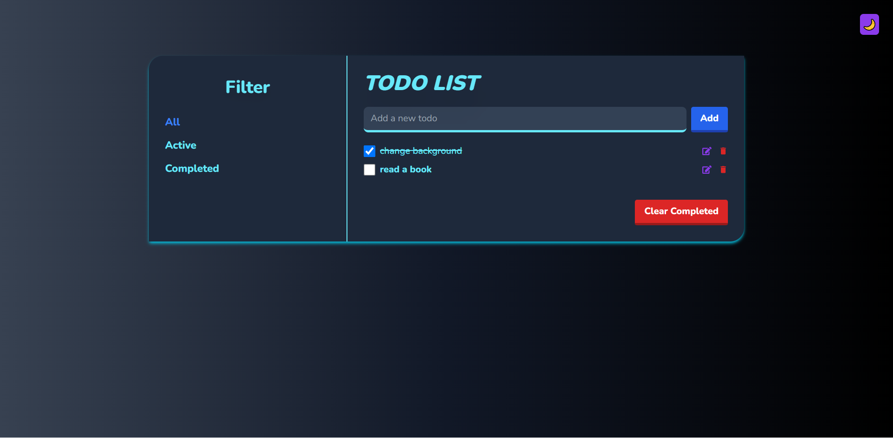

# React Todo List App

This is a simple Todo List app that allows you to keep track of your daily tasks. You can add, delete, edit and mark tasks as completed.

## Features

- Add new tasks to the list
- Mark tasks as completed
- Delete tasks from the list
- Edit tasks in the list
- View a list of all, active, completed tasks
- Save tasks to local storage
- Light/dark mode

## Usage

To add a new task, simply type the task into the input field and press enter. To mark a task as completed, click on the checkbox next to the task. To delete a task, click on the 'delete icon' button next to the task. 
To edit a task, click on the 'edt icon' button next to the task. 

## Technologies Used

This project was created using the following technologies:

- React
- Redux Toolkit
- Tailwind CSS

## Contributing

If you'd like to contribute to this project, please follow these steps:

1. Fork the repository
2. Create a new branch (git checkout -b feature/your-feature-name)
3. Commit your changes (git commit -am 'Add some feature')
4. Push to the branch (git push origin feature/your-feature-name)
5. Create a new pull request

